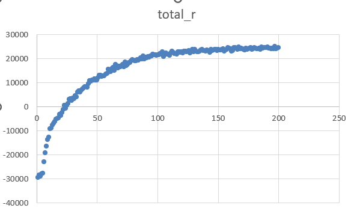

# DRL-5G-V2X
A DRL-based handover management algorithm designed to minimize latency in 5G communications. In this project, I employed the DQN, PPO, and PG algorithms from my own package ```Python-DRL``` to implement a 5G-V2X handover management algorithm. This method proved to reduce unnecessary handovers by over 90% and latency by 27% compared to traditional methods.

## Tech Stack
1. python
2. deep reinforcement learning (DRL)
3. numpy
4. pandas
5. xlsxwriter

## Dependencies
1. Python-DRL==1.0.1
2. pandas
3. xlsxwriter
4. matplotlib

## Environment
There are two environments in this project. In the first environment, there are only two 5G stations; in the second environment, there are sixteen stations arranged in a square matrix.

## Usage Example
```
python .\main.py -m train -t DQN -e 16
python .\main.py -m test_once -t DQN -e 16
python .\main.py -m test_average -t DQN -e 16
python .\main.py -m get_data_set -t DQN -e 16
```

## Results
### 16-station-dqn-training

```
Latency Score: 2.56619
```

### 2-station-dqn-training

```
Latency Score: 1.90041
```